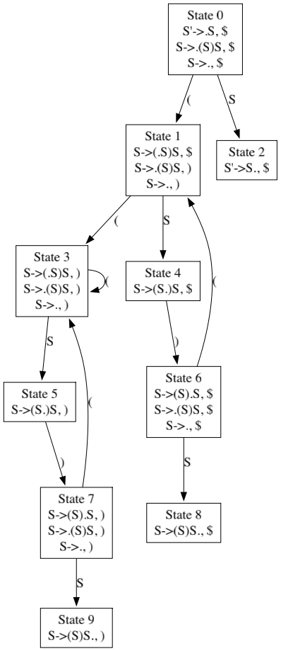
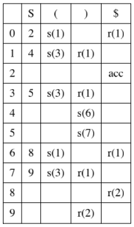

# LR-Parser
Восходящий синтаксический анализатор для проверки принадлежности строк контекстно‑свободным грамматикам за линейное время от длины входа.

## Реализованы алгоритмы LR(0) и LR(1):
- для LR(k)-грамматик определяется принадлежность слов языку ("YES" — при положительном результате, "NO" — при отрицательном);
- в противном случае выводится сообщение о том, что грамматика не относится к классу LR(k), с указанием конфликта, из-за которого невозможно построить управляющую таблицу.

## Ожидаемый формат входных данных:
* Первая строка: перечень нетерминальных символов.
* Вторая строка: перечень терминальных символов.
* Третья строка: целое число |P| - количество правил в КС-грамматике.
* Далее |P| строк: правила в формате `левая часть правила -> правая часть правила`. `ε` в правой части правила обозначается отсутствием правой части (концом строки после `->`).
* Следующая строка: стартовый символ грамматики (нетерминал).
* Затем до строки `exit`: слова (по одному в строке) для проверки принадлежности.

## Быстрый запуск
```bash
go run main.go
```

## Дополнительные возможности
* Переключение между алгоритмами с помощью передачи через `-parser` соответствующих флагов: `lr1` или `lr0`.
* Экспорт построенного автомата и управляющей таблицы в PNG с помощью `graphviz`: `-export-automaton file_to_save.png` и `-export-table file_to_save.png` соответственно (экспортируемые файлы сохраняются в директорию **output**)

## Пример использования:
```bash
go run main.go -parser lr1 \
               -export-automaton automaton.png \
               -export-table table.png
```        
              
**Ввод:**
```
S
()
2
S ->
S -> (S)S
S
()
exit
```
**Вывод:**
```
YES
```
<div style="display: flex;">
  
  
</div>

Больше примеров ввода / вывода содержится в **example/example.txt.**

## Запуск автоматических тестов
Командой `go test -v` из корня проекта.

## Подробнее об алгоритме
[LR(k)-грамматики](https://neerc.ifmo.ru/wiki/index.php?title=LR(k)-%D0%B3%D1%80%D0%B0%D0%BC%D0%BC%D0%B0%D1%82%D0%B8%D0%BA%D0%B8)

[LR(0)-разбор](https://neerc.ifmo.ru/wiki/index.php?title=LR(0)-%D1%80%D0%B0%D0%B7%D0%B1%D0%BE%D1%80)

[LR(1)-разбор](https://neerc.ifmo.ru/wiki/index.php?title=LR(1)-%D1%80%D0%B0%D0%B7%D0%B1%D0%BE%D1%80)
